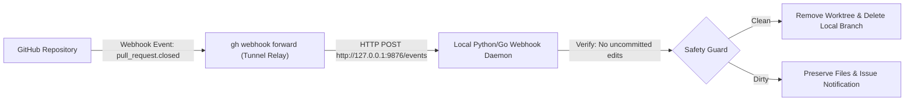

# Local Webhook & Event-Driven Development Automation

This skill defines the architectural pattern and operational procedures for receiving GitHub webhook events locally in real-time, executing automated filesystem and branch cleanups upon PR merge, and ensuring cold-boot reconciliation after offline periods.

---

## 1. Overview & Architectural Design

Traditional local environment maintenance relies on manual cleanup commands or periodic polling. Polling incurs API latency and exhausts GitHub API rate limits.

This skill establishes a **Push-Based Event Architecture**:



---

## 2. Core Invariants & Safety Guarantees

> [!IMPORTANT]
> **DIRTY STATE PRESERVATION**: The webhook daemon must NEVER delete any worktree directory or branch if `git status --porcelain` returns uncommitted files, even if the PR was merged remotely.

> [!TIP]
> **COLD-BOOT RECONCILIATION**: If PRs are merged from a mobile device or secondary machine while the primary workstation is offline or powered off, the daemon must run an initial reconciliation sweep immediately upon boot before entering live listening mode.

---

## 3. Operational Runbook

### A. Starting the Webhook Relay
The GitHub CLI provides built-in webhook forwarding without requiring public DNS or tunneling tools (like ngrok):
```bash
gh webhook forward \
  --repo=<owner>/<repo> \
  --events=pull_request \
  --url=http://127.0.0.1:9876/events
```

### B. Daemon Event Handling Logic
When receiving a `pull_request` event:
```python
# 1. Parse JSON payload
data = json.loads(payload)
action = data.get("action")
merged = data.get("pull_request", {}).get("merged", False)
branch = data.get("pull_request", {}).get("head", {}).get("ref")

# 2. Check for closed PR (merged or closed without merge)
if action == "closed":
    # 3. Locate worktree for branch
    # 4. Check git status (abort if dirty files exist)
    # 5. Execute git worktree remove and git branch -D
```

### C. Systemd User Service Configuration
To run the event daemon automatically on user login:
```ini
# ~/.config/systemd/user/git-webhook-daemon.service
[Unit]
Description=Local Git Webhook Event Daemon
After=network.target

[Service]
Type=simple
ExecStart=/usr/bin/python3 %h/.local/bin/git-webhook-daemon.py
Restart=always
RestartSec=5

[Install]
WantedBy=default.target
```

Enable and start the service:
```bash
systemctl --user daemon-reload
systemctl --user enable --now git-webhook-daemon.service
```

---

## 4. Cold-Boot Offline Catch-Up Algorithm

Whenever the daemon initializes:
```bash
# 1. Inspect all active worktrees
git worktree list --porcelain

# 2. Query GitHub for merged PR branches
gh pr list --state merged --json headRefName --jq '.[].headRefName'

# 3. Reconcile differences: If worktree branch is in merged list and clean, prune it
git worktree remove <worktree-path>
git branch -D <branch-name>
```
