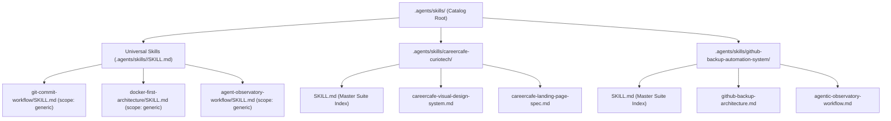

# Skill Taxonomy & Scope Governance Standard

This skill defines the mandatory classification, directory isolation, and validation protocols for authoring and maintaining AI agent skills across the ecosystem.

---

## 1. The Scope Taxonomy

Every skill in the ecosystem MUST belong to exactly one of two distinct categories:

| Scope | Directory Location | Target Audience | Frontmatter Requirement |
|---|---|---|---|
| **`generic`** | `.agents/skills/<skill-name>/SKILL.md` | Any repository across all languages and frameworks | `scope: generic` |
| **`codebase-{slug}`** | `.agents/skills/<codebase-slug>/<skill-name>.md` | Exclusively the specified codebase / project suite | `scope: codebase-{slug}` |



---

## 2. Invariants for `scope: generic` Skills

Skills located under `.agents/skills/<skill-name>/` are distributed to downstream projects via `skills-sync pull`. They must remain strictly universal:

1. **Frontmatter**: Must explicitly set `scope: generic`.
2. **Zero Hardcoded Paths**: Never reference local machine paths (e.g. `file:///home/...`, `/Users/...`). Use relative or conceptual directory paths (`backend/`, `src/`, `config/`).
3. **Zero Hardcoded Usernames**: Never hardcode GitHub usernames or email addresses. Use parameters like `<github-username>`, `<developer-or-agent>`, `@me`, or `@$(gh api user -q .login)`.
4. **Zero Project-Specific Leaks**: Never mention specific proprietary product names, specific microservice package names, or proprietary database schemas in normative rules. Examples must be generalized.
5. **No Domain-Specific UI Palettes**: Project-specific design tokens (e.g. brand-specific hex codes, product-specific color palettes) belong in codebase suites, not in generic skills.

---

## 3. Invariants for `scope: codebase-{slug}` Skills

Skills located under dedicated suite folders (e.g. `.agents/skills/<codebase-slug>/`) are tailored exclusively to a single application or product:

1. **Naming & Directory Convention**: All codebase skills live in a dedicated suite directory `.agents/skills/<codebase-slug>/` (kebab-case, e.g., `careercafe-curiotech`, `github-backup-automation-system`).
2. **Suite Structure**:
   - `SKILL.md`: Mandatory master entrypoint providing an overarching system topology, architectural index, and links to all sibling skill files in the suite.
   - `<skill-name>.md`: Individual skill runbooks containing specific workflows, runbooks, or specifications.
3. **Frontmatter Matching**: The `scope` field in every `.md` file with frontmatter MUST begin with `codebase-` (e.g. `scope: codebase-curiotech-careercafe` or `scope: codebase-github-backup-automation-system`).
4. **Explicit Disclaimer**: The body of every codebase-specific skill file MUST begin with an explicit alert block declaring its target repository:
   ```markdown
   > [!IMPORTANT]
   > **CODEBASE-SPECIFIC SCOPE**: This skill is strictly specific to **<Codebase Name>**.
   ```
5. **Concrete Runbooks**: May contain exact file paths, exact service names, specific database schemas, and project-specific CLI workflows.

---

## 4. Cross-Contamination Prevention Rule

> [!CAUTION]
> **STRICT PROHIBITION ON COPY-PASTING ACROSS BOUNDARIES**:
> - AI agents and human contributors MUST NEVER place codebase-specific instructions, paths, or proprietary names into generic skill files.
> - Automated CI validators (`validate-skills.py`) and unit tests (`test_skills_scope.py`) will automatically reject any generic skill that contains forbidden codebase-specific terms.
> - Downstream synchronization engines (`skills-sync`) sync generic skills universally and preserve codebase-specific skill suites within their target codebases.

---

## 5. Authoring & Validation Runbook

When creating a new skill:

1. **Determine Scope & Placement**:
   - **Generic Skill**: Is this skill applicable to any standard software repository?
     $\rightarrow$ Create directory `.agents/skills/<skill-name>/` with `SKILL.md` containing `scope: generic`.
   - **Codebase-Specific Skill**: Is this skill tightly coupled to a specific product, schema, or brand?
     $\rightarrow$ Add to the relevant suite directory `.agents/skills/<codebase-slug>/<skill-name>.md` with `scope: codebase-<slug>` and the required `[!IMPORTANT]` disclaimer block. If it's a new codebase suite, also provide `SKILL.md` as the master index.

2. **Execute Validation**:
   ```bash
   # Run the unified validator across all scopes
   python3 scripts/validate-skills.py

   # Run the scope boundary unit test suite
   python3 -m unittest discover -s tests -p "test_*.py"
   ```
