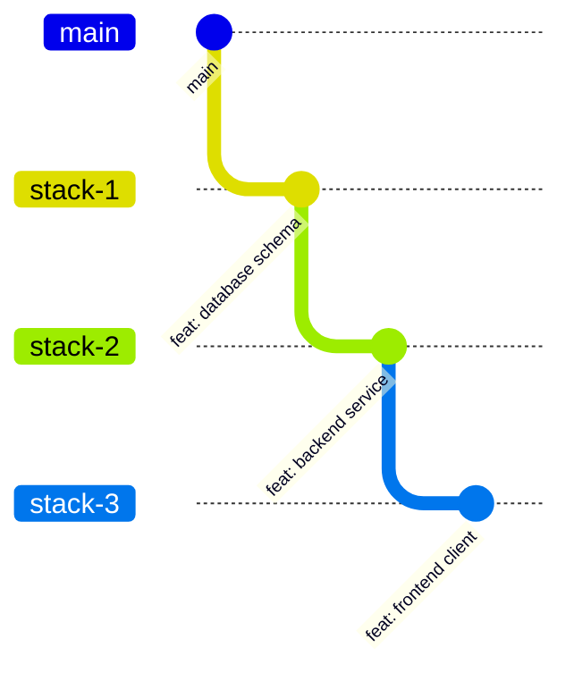

# Stacked Pull Requests (Stacked Diffs) Workflow

This skill defines the official standards and runbooks for decomposing large, complex features into a sequential chain of small, atomic pull requests that build upon each other ("stacked PRs").

---

## 1. Overview & Motivation

Monolithic PRs (> 400 lines) slow down velocity, create massive merge conflicts, and lead to superficial code reviews. 

The Stacked PR pattern breaks a multi-step project into an ordered sequence of isolated, independently reviewable units:
- **Stack Item 1**: Core schema / foundational types (targets `main`).
- **Stack Item 2**: Logic & services utilizing schema (targets `branch-1`).
- **Stack Item 3**: UI or public API consuming services (targets `branch-2`).

Developers and AI agents can continue authoring downstream layers without waiting for upstream layers to complete code review or merge into `main`.

---

## 2. Dependency Tree & Branching Model



### Stacking Invariants:
1. **Parent Tracking**: Every branch in a stack must explicitly track its immediate upstream parent branch.
2. **Atomic Commits**: Each stack layer must be a self-contained, working state that passes linters and tests.
3. **PR Base Targeting**: 
   - `stack-1` opens PR targeting `main`.
   - `stack-2` opens PR targeting `stack-1`.
   - `stack-3` opens PR targeting `stack-2`.
   This ensures each PR diff shows ONLY the incremental changes introduced in that layer.

---

## 3. Operational Runbook

### A. Creating the First Layer (Bottom of Stack)
```bash
git checkout main
git pull origin main
git checkout -b feature-layer-1
# Make edits, commit
git push -u origin feature-layer-1
gh pr create --base main --title "feat(layer-1): foundational schema"
```

### B. Creating Dependent Layer (Stacking)
```bash
# Branch directly from feature-layer-1
git checkout feature-layer-1
git checkout -b feature-layer-2

# Make edits, commit
git push -u origin feature-layer-2

# Target feature-layer-1 as the base branch!
gh pr create --base feature-layer-1 --title "feat(layer-2): business logic service"
```

### C. Rebasing the Stack When Upstream Changes Mutate
If review comments require amending commits in `feature-layer-1`:
```bash
# 1. Update feature-layer-1
git checkout feature-layer-1
git commit --amend # or add new commit
git push origin feature-layer-1 --force-with-lease

# 2. Rebase feature-layer-2 onto the updated feature-layer-1
git checkout feature-layer-2
git rebase --onto feature-layer-1 <old-feature-layer-1-head> feature-layer-2
git push origin feature-layer-2 --force-with-lease
```

### D. Merging Down the Stack (Bottom-Up)
When `feature-layer-1` is approved and merged into `main`:
1. GitHub automatically retargets `feature-layer-2` to point to `main` (if base branch deletion is enabled), OR
2. Manually retarget `feature-layer-2`:
   ```bash
   gh pr edit 46 --base main
   git checkout feature-layer-2
   git fetch origin main
   git rebase origin/main
   git push origin feature-layer-2 --force-with-lease
   ```

---

## 4. Safety Directives & Alerts

> [!IMPORTANT]
> **FORCE PUSH SAFELY**: When updating stacked branches following rebases, ALWAYS use `--force-with-lease`. Never use raw `--force`.

> [!WARNING]
> **AVOID REVERSING THE MERGE ORDER**: Never merge a top layer (`stack-3`) before its foundational layers (`stack-1`, `stack-2`) are merged into `main`. Stacks must always merge from bottom to top.
