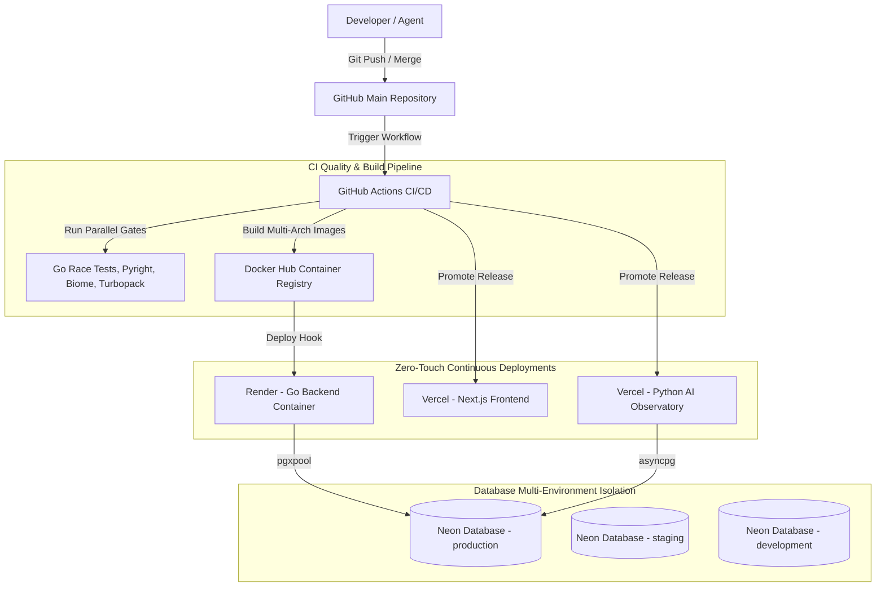

# GitHub Backup Observatory & Management System

[](LICENSE)
[](https://go.dev/)
[](https://python.org/)
[](https://nextjs.org/)

A distributed backup automation and AI-driven telemetry observatory. The system automates repository archiving, stores historical analytics in PostgreSQL, provides live WebSocket streaming, performs hybrid search using pgvector and full-text search, and hosts an AI Agentic Observatory for automated incident analysis and report generation.

---

## Live Resources

- **Production Dashboard**: [github.mishrashardendu22.is-a.dev](https://github.mishrashardendu22.is-a.dev)
- **API Documentation**: [docs/API_REFERENCE.md](docs/API_REFERENCE.md)
- **Branching Policy**: [BRANCHING.md](BRANCHING.md)
- **Repository Workflow**: [WORKFLOW.md](WORKFLOW.md)
- **Pre-Commit Gate**: [docs/PRECOMMIT_WORKFLOW.md](docs/PRECOMMIT_WORKFLOW.md)
- **Video Walkthrough**: [YouTube Demonstration](https://www.youtube.com/watch?v=be0UBwk2asc)

---

## Architecture & Zero-Touch Deployment Model

The system uses an automated **Docker-first CI/CD and deployment pipeline**:
- **Continuous Integration**: GitHub Actions runs parallel quality gates (formatting, linting, tests, static typing, security scans, Docker buildx caching).
- **Container Registry**: Automatically builds and publishes multi-tier Docker images to **Docker Hub** (`:latest`, `:sha-<sha>`, `:<version>`).
- **Continuous Deployment**:
  - **Go Backend**: Deployed as a Docker container on **Render** (via Render Blueprint / webhook deploy hooks).
  - **Frontend & Observatory**: Deployed on **Vercel** Edge and Serverless runtimes.
- **Database Branching**: **Neon PostgreSQL** with instant branch isolation (`production`, `staging`, `development`).



### Services & Deployment Infrastructure

| Subsystem | Technology Stack | Deployment Target | Container Registry / Live URL |
| :--- | :--- | :--- | :--- |
| **Go Backend API** | Go 1.24, Fiber v2, pgxpool | **Render (Docker Web Service)** | `mishrashardendu22/github-backup-backend:latest` |
| **Backup Worker** | Go 1.24 CLI, Git, SSH | **Local / Cron Container** | `mishrashardendu22/github-backup-worker:latest` |
| **Next.js Frontend** | Next.js 16 (Turbopack), React 19, Tailwind v4 | **Vercel Production** | [`github.mishrashardendu22.is-a.dev`](https://github.mishrashardendu22.is-a.dev) |
| **AI Observatory** | FastAPI, Python 3.12, LangChain, OpenRouter | **Vercel / Container** | `mishrashardendu22/github-backup-observatory:latest` |
| **PostgreSQL DB** | PostgreSQL 16 + `pgvector` | **Neon Cloud Managed** | Instant branching (`production`, `staging`, `development`) |


---

## Local Development Workflow

Run individual services or the unified development environment using the provided `Makefile`:

```bash
# 1. Start all 3 web services concurrently (Go: 8080, Python: 8000, Frontend: 3000)
make dev

# 2. Run the autonomous Backup Worker CLI
make backup

# 3. Configure Git pre-commit validation hooks (.githooks/)
make hooks-install

# 4. Run full pre-commit validation gate across all services
make pre-commit

# 5. Run linters and formatters across Go, Python, and TypeScript
make lint
make format
make typecheck

# 6. Run all test suites across Go and Python
make test

# 7. Build Go binaries and Next.js frontend
make build
```

> **Pre-Commit Workflow**: Learn how the intelligent staged-file validation gate works in [`docs/PRECOMMIT_WORKFLOW.md`](docs/PRECOMMIT_WORKFLOW.md).

### Default Port Mappings
- **Frontend Dashboard**: `http://localhost:3000`
- **Go REST API & Metrics**: `http://localhost:8080` (Metrics: `http://localhost:8080/metrics`)
- **Python Observatory**: `http://localhost:8000` (Metrics: `http://localhost:8000/metrics`)

---

## Deployment & Service Configuration

### 1. Frontend (Vercel)
- **Root Directory**: `frontend/`
- **Build Command**: `pnpm run build`
- **Output Directory**: Next.js default (`.next`)
- **Environment Variables**:
  - `NEXT_PUBLIC_API_URL`: Your Render Go backend public URL (e.g. `https://your-backend.onrender.com`)
  - `NEXT_PUBLIC_AGENT_URL`: Your Vercel Python observatory public URL (e.g. `https://your-observatory.vercel.app`)

### 2. Python Observatory (Vercel)
- **Root Directory**: `agentic-observatory/`
- **Environment Variables**:
  - `GO_BACKEND_URL`: URL to your Go Backend on Render
  - `DATABASE_URL`: PostgreSQL async connection string (`postgresql+asyncpg://...`)
  - `INTERNAL_SECRET`: Shared secret matching Go Backend `INTERNAL_SECRET`
  - `OPENROUTER_API_KEY`: OpenRouter API key for LLM and embeddings
  - `JWT_SECRET`: Secret key for JWT session tokens
  - `CHAT_USERNAME` / `CHAT_PASSWORD`: Admin credentials for chat authentication

### 3. Go Backend (Render)
- **Environment**: Go Native Web Service
- **Build Command**: `cd backend && go build -o app main.go`
- **Start Command**: `./backend/app`
- **Environment Variables**:
  - `DATABASE_URL`: PostgreSQL connection string (`postgresql://...`)
  - `INTERNAL_SECRET`: Shared secret for protected endpoints

### 4. Autonomous Backup Worker (Local / Scheduled Cron)
- **Root Directory**: `backup-worker/`
- **Run Command**: `make backup` or `cd backup-worker && go run main.go`
- **Environment Variables**:
  - `GITHUB_TOKEN_PERSONAL`: Personal access token for public & user repo discovery
  - `GITHUB_TOKEN_PRIVATE`: Personal access token with `repo` scope for private repos
  - `PROJECT_ACCOUNT`: Target GitHub username
  - `ORG_ACCOUNT`: Target GitHub organization
  - `BACKUP_REPO_PATH`: Git SSH clone URL of target backup repository
  - `DATABASE_URL`: PostgreSQL connection string for real-time telemetry

---

## Database Migrations & Versioning

The Go backend features an embedded versioned migration runner (`backend/db/migrator.go`):

| Version | Migration File | Description |
| :--- | :--- | :--- |
| `000001` | `000001_initial_schema.up.sql` | Core tables (`backup_runs`, `backup_results`, `execution_logs`, `analytics_snapshots`, `backup_fixes`) |
| `000002` | `000002_embeddings_and_search.up.sql` | Extensions `vector` & `pg_trgm`, tables `embedding_generations`, `embedding_chunks`, `embedding_jobs` |
| `000003` | `000003_normalize_schema_and_metadata.up.sql` | Creates `ai_session_metadata`, enforces 1-to-1 run analytics index, cleans legacy empty strings to SQL `NULL` |
| `000004` | `000004_cleanup_stale_embeddings_and_errors.up.sql` | Cascading deletion of `RETIRED`/`FAILED` generations and stale jobs, cleans investigation errors |
| `000005` | `000005_deterministic_embedding_lifecycle.up.sql` | Partial indexes on errors/commits, chunk metadata normalization, blue-green promotion |

Migrations use non-destructive `CREATE TABLE IF NOT EXISTS` statements and preserve all existing historical data.

---

## Backup & Disaster Recovery

Automate database backups with SHA256 integrity checks:

```bash
# Run backup script (saves to backups/postgres/ with 14-day retention)
make backup-db

# Restore from a backup archive
make restore-db BACKUP_FILE=backups/postgres/gbm_pg_backup_YYYYMMDD_HHMMSS.sql.gz
```

---

## Configuration Reference (Secrets & Endpoints)

| Environment Variable | Service | Purpose | Type |
| :--- | :--- | :--- | :--- |
| `DATABASE_URL` | Backend, Observatory, Worker | PostgreSQL connection string | Secret |
| `INTERNAL_SECRET` | Backend, Observatory | Shared secret for internal API auth | Secret |
| `OPENROUTER_API_KEY` | Observatory | API key for OpenRouter AI | Secret |
| `JWT_SECRET` | Observatory | Secret key for JWT signing | Secret |
| `CHAT_USERNAME` / `CHAT_PASSWORD` | Observatory | Admin credentials for dashboard chat | Secret |
| `GO_BACKEND_URL` | Observatory | URL to deployed Go Backend API | Endpoint |
| `NEXT_PUBLIC_API_URL` | Frontend | URL to deployed Go Backend API | Endpoint |
| `NEXT_PUBLIC_AGENT_URL` | Frontend | URL to deployed Python Observatory | Endpoint |
| `SMTP_USERNAME` / `SMTP_PASSWORD` | Observatory | SMTP email credentials for report dispatch | Secret |
| `SMTP_FROM` / `SMTP_TO` | Observatory | Sender and recipient email addresses | Config |
| `GITHUB_TOKEN_PRIVATE` | Worker CLI | Token for private repo discovery/cloning | Secret |
| `GITHUB_TOKEN_PERSONAL` | Worker CLI | Token for GitHub API rate limits | Secret |

---

## Contributing & License

Contributions are welcome! Please review [CONTRIBUTING.md](CONTRIBUTING.md) before submitting pull requests.

Distributed under the MIT License. See `LICENSE` for more information.
